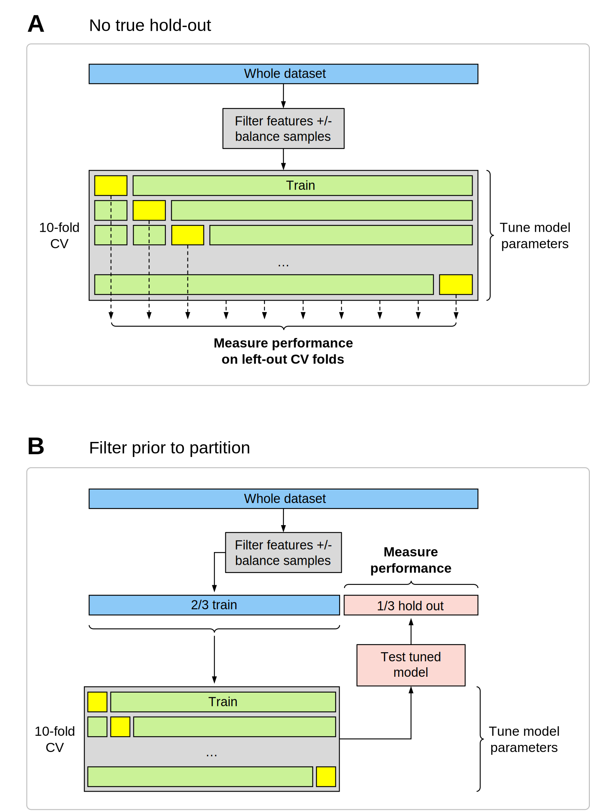
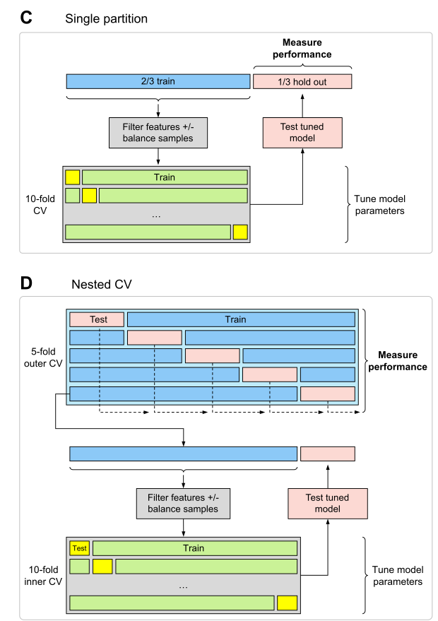
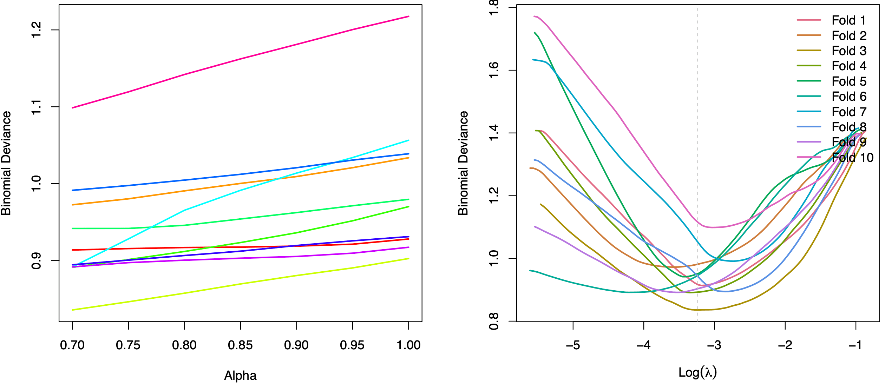
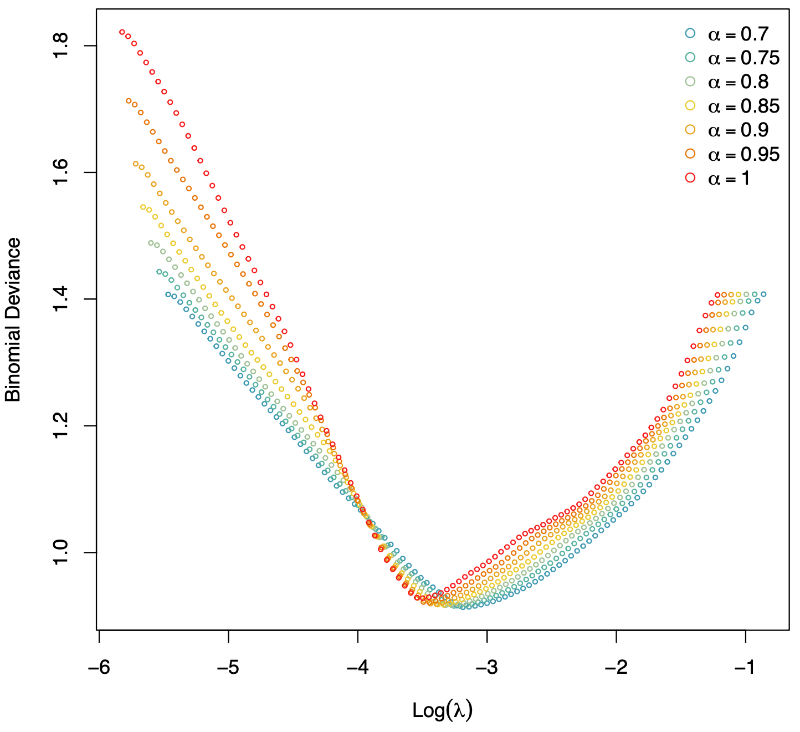
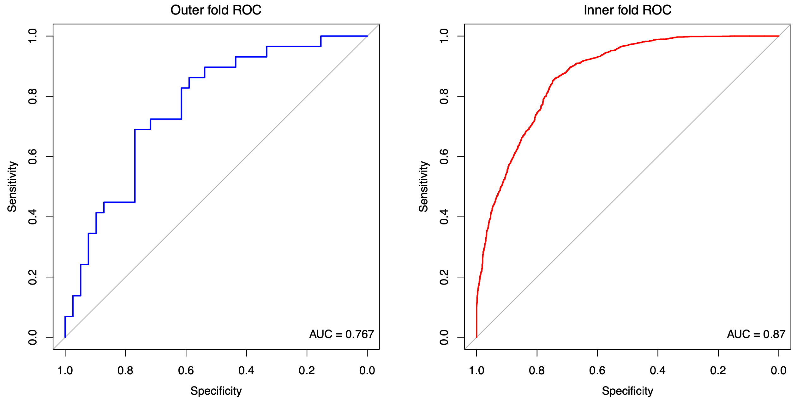
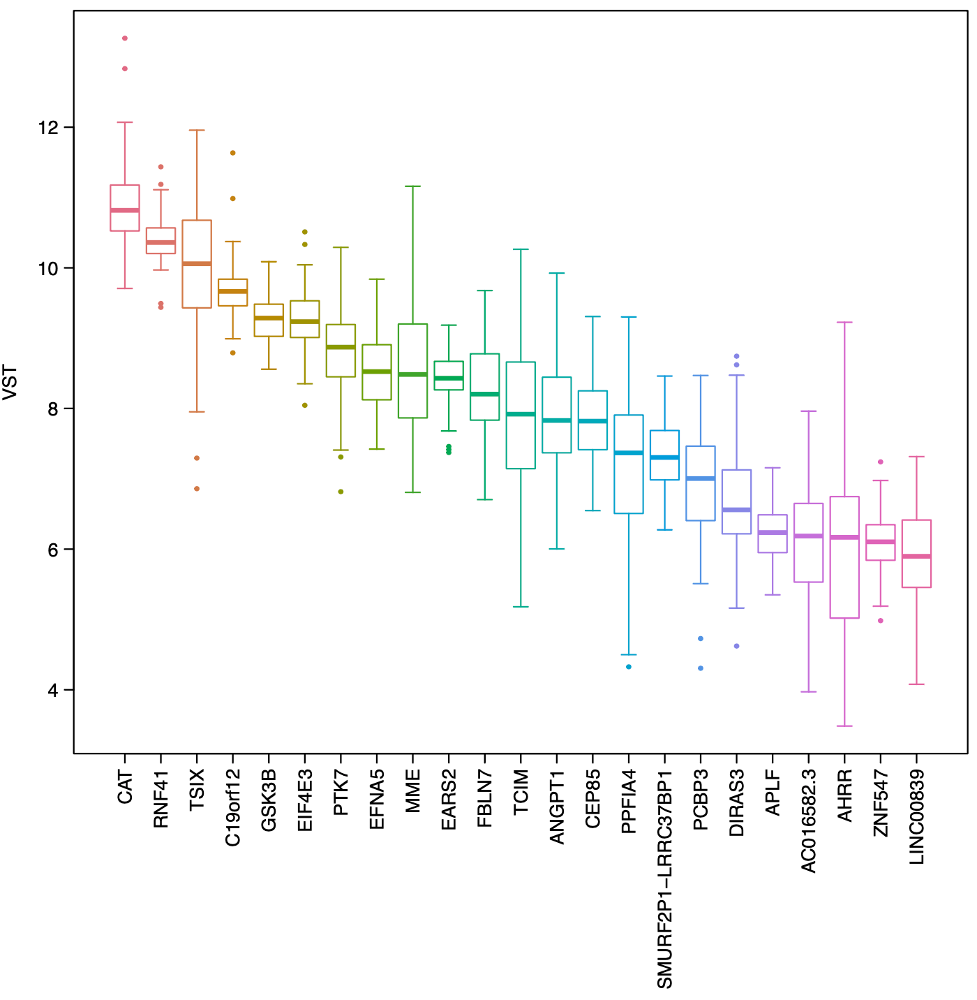

```{r setup, include = FALSE}
knitr::opts_chunk$set(
  collapse = TRUE,
  warning = FALSE
)
library(nestedcv)
library(pROC)
```

# Introduction

The motivation for this package is to provide functions which help with the
development and tuning of machine learning models in biomedical data where the
sample size is frequently limited, but the number of predictors may be
significantly larger (P >> n). While most machine learning pipelines involve
splitting data into training and testing cohorts, typically 2/3 and 1/3
respectively, medical datasets may be too small for this, and so determination
of accuracy in the left-out test set suffers because the test set is small.
Nested cross-validation (CV) provides a way to get round this, by maximising use
of the whole dataset for testing overall accuracy, while maintaining the split
between training and testing.

In addition typical biomedical datasets often have many 10,000s of possible
predictors, so filtering of predictors is commonly needed. However, it has been
demonstrated that filtering on the whole dataset creates a bias when determining
accuracy of models (Vabalas et al, 2019). Feature selection of predictors should
be considered an integral part of a model, with feature selection performed only
on training data. Then the selected features and accompanying model can be
tested on hold-out test data without bias. Thus, it is recommended that any
filtering of predictors is performed within the CV loops, to prevent test data
information leakage.

This package enables nested cross-validation (CV) to be performed using the
commonly used `glmnet` package, which fits elastic net regression models, and
the `caret` package, which is a general framework for fitting a large number of
machine learning models. In addition, `nestedcv` adds functionality to enable
cross-validation of the elastic net alpha parameter when fitting `glmnet`
models.

`nestedcv` partitions the dataset into outer and inner folds (default 10x10
folds). The inner fold CV, (default is 10-fold), is used to tune optimal
hyperparameters for models. Then the model is fitted on the whole inner fold and
tested on the left-out data from the outer fold. This is repeated across all
outer folds (default 10 outer folds), and the unseen test predictions from the
outer folds are compared against the true results for the outer test folds and
the results concatenated, to give measures of accuracy (e.g. AUC and accuracy
for classification, or RMSE for regression) across the whole dataset.

A final round of CV is performed on the whole dataset to determine
hyperparameters to fit the final model to the whole data, which can be used for
prediction with external data.

### Variable selection

While some models such as `glmnet` allow for sparsity and have variable
selection built-in, many models fail to fit when given massive numbers of
predictors, or perform poorly due to overfitting without variable selection. In
addition, in medicine one of the goals of predictive modelling is commonly the
development of diagnostic or biomarker tests, for which reducing the number of
predictors is typically a practical necessity.

Several filter functions (t-test, Wilcoxon test, anova, Pearson/Spearman
correlation, random forest variable importance, and ReliefF from the `CORElearn`
package) for feature selection are provided, and can be embedded within the
outer loop of the nested CV.

# Installation

```{r eval = FALSE}
install.packages("nestedcv")
library(nestedcv)
```

# Examples

### Importance of nested CV

The following simulated example demonstrates the bias intrinsic to datasets
where *P* >> *n* when applying filtering of predictors to the whole dataset
rather than to training folds.

```{r}
## Example binary classification problem with P >> n
x <- matrix(rnorm(150 * 2e+04), 150, 2e+04)  # predictors
y <- factor(rbinom(150, 1, 0.5))  # binary response

## Partition data into 2/3 training set, 1/3 test set
trainSet <- caret::createDataPartition(y, p = 0.66, list = FALSE)

## t-test filter using whole test set
filt <- ttest_filter(y, x, nfilter = 100)
filx <- x[, filt]

## Train glmnet on training set only using filtered predictor matrix
library(glmnet)
fit <- cv.glmnet(filx[trainSet, ], y[trainSet], family = "binomial")

## Predict response on test set
predy <- predict(fit, newx = filx[-trainSet, ], s = "lambda.min", type = "class")
predy <- as.vector(predy)
predyp <- predict(fit, newx = filx[-trainSet, ], s = "lambda.min", type = "response")
predyp <- as.vector(predyp)
output <- data.frame(testy = y[-trainSet], predy = predy, predyp = predyp)

## Results on test set
## shows bias since univariate filtering was applied to whole dataset
predSummary(output)

## Nested CV
fit2 <- nestcv.glmnet(y, x, family = "binomial", alphaSet = 7:10 / 10,
                      filterFUN = ttest_filter,
                      filter_options = list(nfilter = 100))
fit2

testroc <- pROC::roc(output$testy, output$predyp, direction = "<", quiet = TRUE)
inroc <- innercv_roc(fit2)
plot(fit2$roc)
lines(inroc, col = 'blue')
lines(testroc, col = 'red')
legend('bottomright', legend = c("Nested CV", "Left-out inner CV folds", 
                                 "Test partition, non-nested filtering"), 
       col = c("black", "blue", "red"), lty = 1, lwd = 2, bty = "n")
```

In this example the dataset is pure noise. Filtering of predictors on the whole
dataset is a source of leakage of information about the test set, leading to
substantially overoptimistic performance on the test set as measured by ROC AUC.

Figures A & B below show two commonly used, but biased methods in which
cross-validation is used to fit models, but the result is a biased estimate of
model performance. In scheme A, there is no hold-out test set at all, so there
are two sources of bias/ data leakage: first, the filtering on the whole
dataset, and second, the use of left-out CV folds for measuring performance.
Left-out CV folds are known to lead to biased estimates of performance as the
tuning parameters are 'learnt' from optimising the result on the left-out CV
fold.

In scheme B, the CV is used to tune parameters and a hold-out set is used to
measure performance, but information leakage occurs when filtering is applied to
the _whole_ dataset. Unfortunately this is commonly observed in many studies
which apply differential expression analysis on the whole dataset to select
predictors which are then passed to machine learning algorithms.

```{r, out.width='75%', fig.align="center", echo=FALSE}

```

Figures C & D below show two valid methods for fitting a model with CV for
tuning parameters as well as unbiased estimates of model performance. Figure C
is a traditional hold-out test set, with the dataset partitioned 2/3 training,
1/3 test. Notably the critical difference between scheme B above, is that the
filtering is only done on the training set and not on the whole dataset.

Figure D shows the scheme for fully nested cross-validation. Note that filtering
is applied to each outer CV training fold. The key advantage of nested CV is
that outer CV test folds are collated to give an improved estimate of
performance compared to scheme C since the numbers for total testing are larger.

```{r, out.width='75%', fig.align="center", echo=FALSE}

```

### Nested CV with glmnet

In the real life example below, RNA-Sequencing gene expression data from
synovial biopsies from patients with rheumatoid arthritis in the R4RA randomised
clinical trial (Humby et al, 2021) is used to predict clinical response to the
biologic drug rituximab. Treatment response is determined by a clinical measure,
namely Clinical Disease Activity Index (CDAI) 50% response, which has a binary
outcome: treatment success or failure (response or non-response). This dataset
contains gene expression on over 50,000 genes in arthritic synovial tissue from
133 individuals, who were randomised to two drugs (rituximab and tocilizumab).
First, we remove genes of low expression using a median cut-off (this still
leaves >16,000 genes), and we subset the dataset to the rituximab treated
individuals (n=68).

```{r eval = FALSE}
# Raw RNA-Seq data for this example is located at:
# https://www.ebi.ac.uk/arrayexpress/experiments/E-MTAB-11611/

# set up data
load("/../R4RA_270821.RData")

index <- r4ra.meta$Outliers_Detected_On_PCA != "outlier" & r4ra.meta$Visit == 3 &
          !is.na(r4ra.meta$Visit)
metadata <- r4ra.meta[index, ]
dim(metadata)  # 133 individuals

medians <- Rfast::rowMedians(as.matrix(r4ra.vst))
data <- t(as.matrix(r4ra.vst))
# remove low expressed genes
data <- data[index, medians > 6]  
dim(data)  # 16254 genes

# Rituximab cohort only
yrtx <- metadata$CDAI.response.status.V7[metadata$Randomised.medication == "Rituximab"]
yrtx <- factor(yrtx)
data.rtx <- data[metadata$Randomised.medication == "Rituximab", ]

# no filter
res.rtx <- nestcv.glmnet(y = yrtx, x = data.rtx,
                         family = "binomial", cv.cores = 8,
                         alphaSet = seq(0.7, 1, 0.05))
res.rtx
```

<!-- previous output -->
```
## Nested cross-validation with glmnet
## No filter
## 
## Final parameters:
## lambda   alpha  
## 0.1511  0.7950  
## 
## Final coefficients:
## (Intercept)  AC016582.3       PCBP3    TMEM170B      EIF4E3     SEC14L6       CEP85        APLF 
##   0.8898659  -0.2676580  -0.2667770   0.2456329   0.2042326  -0.1992225   0.1076051  -0.1072684 
##       EARS2        PTK7       EFNA5        MEST      IQANK1    MTATP6P1       GSK3B       STK40 
##  -0.1036846  -0.0919594  -0.0882686   0.0769173  -0.0708992   0.0545392   0.0469272   0.0316988 
##     SUV39H2  AC005670.2      ZNF773        XIST       STAU2      DIRAS3 
##   0.0297370   0.0184851  -0.0170861  -0.0100934   0.0016182  -0.0009975 
## 
## Result:
##               AUC           Accuracy  Balanced accuracy  
##            0.7648             0.7059             0.6773
```

Use `summary()` to see full information from the nested model fitting. `coef()`
can be used to show the coefficients of the final fitted model. For comparison,
performance metrics from the left-out inner CV test folds can be viewed using
`innercv_summary()`. Performance metrics on the outer training folds can be
viewed with `train_summary()`, provided the argument `outer_train_predict` was
set to `TRUE` in the original call to either `nestcv.glmnet()`, `nestcv.train()`
or `outercv()`.

Filters can be used by setting the `filterFUN` argument. Options for the filter 
function are passed as a list through `filter_options`.

```{r eval = FALSE}
# t-test filter
res.rtx <- nestcv.glmnet(y = yrtx, x = data.rtx, filterFUN = ttest_filter,
                         filter_options = list(nfilter = 300, p_cutoff = NULL),
                         family = "binomial", cv.cores = 8,
                         alphaSet = seq(0.7, 1, 0.05))
summary(res.rtx)
```

Output from the nested CV with glmnet can be plotted to show how deviance is 
affected by alpha and lambda.

```{r eval = FALSE}
plot_alphas(res.rtx)
plot_lambdas(res.rtx)
```

```{r, out.width='100%', fig.align="center", echo=FALSE}

```

The tuning of alpha for each outer fold can be plotted.

```{r eval = FALSE}
# Fold 1 line plot
plot(res.rtx$outer_result[[1]]$cvafit)

# Scatter plot
plot(res.rtx$outer_result[[1]]$cvafit, type = 'p')

# Number of non-zero coefficients
plot(res.rtx$outer_result[[1]]$cvafit, xaxis = 'nvar')
```

```{r, out.width='100%', fig.align="center", echo=FALSE}

```

ROC curves from left-out folds from both outer and inner CV can be plotted. Note
that the AUC based on the left-out outer folds is the unbiased estimate of
accuracy, while the left-out inner folds demonstrate bias due to the
optimisation of the model's hyperparameters on the inner fold data.

```{r eval = FALSE}
# Outer CV ROC
plot(res.rtx$roc, main = "Outer fold ROC", font.main = 1, col = 'blue')
legend("bottomright", legend = paste0("AUC = ", signif(pROC::auc(res.rtx$roc), 3)), bty = 'n')

# Inner CV ROC
rtx.inroc <- innercv_roc(res.rtx)
plot(rtx.inroc, main = "Inner fold ROC", font.main = 1, col = 'red')
legend("bottomright", legend = paste0("AUC = ", signif(pROC::auc(rtx.inroc), 3)), bty = 'n')
```

```{r, out.width='100%', fig.align="center", echo=FALSE}

```

The overall expression level of each gene selected in the final model can be 
compared with a boxplot.

```{r eval = FALSE}
boxplot_model(res.rtx, ylab = "VST")
```

```{r, out.width='70%', fig.align="center", echo=FALSE}

```

Leave-one-out cross-validation (LOOCV) can be performed on the outer folds.

```{r eval = FALSE}
# Outer LOOCV
res.rtx <- nestcv.glmnet(y = yrtx, x = data.rtx, min_1se = 0, filterFUN = ttest_filter,
                         filter_options = list(nfilter = 300, p_cutoff = NULL),
                         outer_method = "LOOCV",
                         family = "binomial", cv.cores = 8,
                         alphaSet = seq(0.7, 1, 0.05))
summary(res.rtx)
```

### Filters

Multiple filters for variable reduction are available including:

----------------- ---------------------------------------------------------
`ttest_filter`    t-test

`wilcoxon_filter` Wilcoxon (Mann-Whitney) test

`anova_filter`    one-way ANOVA

`correl_filter`   Pearson or Spearman correlation for regression modelling

`lm_filter`       linear model with covariates

`rf_filter`       random forest variable importance

`relieff_filter`  ReliefF and other methods available via CORElearn

`boruta_filter`   Boruta
----------------- ---------------------------------------------------------

```{r eval = FALSE}
# Random forest filter
res.rtx <- nestcv.glmnet(y = yrtx, x = data.rtx, min_1se = 0.5, filterFUN = rf_filter,
                         filter_options = list(nfilter = 300),
                         family = "binomial", cv.cores = 8, 
                         alphaSet = seq(0.7, 1, 0.05))
summary(res.rtx)

# ReliefF algorithm filter
res.rtx <- nestcv.glmnet(y = yrtx, x = data.rtx, min_1se = 0, filterFUN = relieff_filter,
                         filter_options = list(nfilter = 300),
                         family = "binomial", cv.cores = 8, 
                         alphaSet = seq(0.7, 1, 0.05))
summary(res.rtx)
```

Bootstrapped versions of the univariate filters are available [see
`boot_ttest()`]. These use repeated random sampling to try to improve stability
of ranking of predictors based on univariate statistics.

### Custom filter

It is fairly straightforward to create your own custom filter, which can be
embedded within the outer CV loops via `nestcv.glmnet`, `nestcv.train` or
`outercv`. The function simply must be of the form

```{r eval = FALSE}
filter <- function(y, x, ...) {}
```

Other arguments can be passed in to the filter function as a named list via the
`filter_options` argument. The function must return a vector of indices of those
predictors in `x` which are to be retained for downstream model fitting as well
as prediction on left-out outer folds. Importantly the filter function is
applied independently to each outer CV fold and not run on the whole data.

Finally once the model performance has been calculated by nested CV. The filter
is applied to the whole dataset when refitting the final model to the full
dataset.

### Class imbalance

Class imbalance is known to impact on model fitting for certain model types,
e.g. random forest, SVM. Models may tend to aim to predict the majority class
and ignore the minority class since selecting the majority class can give high
accuracy purely by chance. While performance measures such as balanced accuracy
can give improved estimates of model performance, techniques for rebalancing
data have been developed. These include:

* Random oversampling of the minority class
* Random undersampling of the majority class
* Combination of oversampling and undersampling
* Synthesising new data in the minority class, e.g. SMOTE (Chawla et al, 2002)

These are available within `nestedcv` using the `balance` argument to specify a
balancing function. Other arguments to control the balancing process are passed
to the function as a list via `balance_options`.

-------------- --------------------------------------------------------------
`randomsample` Random oversampling of the minority class and/or undersampling 
               of the majority class

`smote`        Synthetic minority oversampling technique (SMOTE)
-------------- --------------------------------------------------------------

Note that in `nestedcv` balancing is performed only on the outer training folds,
immediately prior to filtering of features. This is important as balancing the
whole dataset prior to the outer CV leads to data leakage of outer CV hold-out
samples into the outer training folds.

The number of samples in each class in the outer CV folds can be checked on
`nestedcv` objects using the function `class_balance()`.

For logistic regression methods like glmnet, balancing may actually be
deleterious. Using weights to apply increased weight to minority samples is
typically preferred as a method for improving model fitting.

The following example simulates an imbalanced dataset with 150 samples and
20,000 predictors of which only the first 30 are weak predictors.

```{r}
## Imbalanced dataset
set.seed(1, "L'Ecuyer-CMRG")
x <- matrix(rnorm(150 * 2e+04), 150, 2e+04)  # predictors
y <- factor(rbinom(150, 1, 0.2))  # imbalanced binary response
table(y)

## first 30 parameters are weak predictors
x[, 1:30] <- rnorm(150 * 30, 0, 1) + as.numeric(y)*0.7
```

Here we illustrate the use of `randomsample()` to balance x & y *outside* of the
CV loop by random oversampling minority group. Then we fit a nested CV glmnet
model on the balanced data.

```{r}
out <- randomsample(y, x)
y2 <- out$y
x2 <- out$x
table(y2)

## Nested CV glmnet with unnested balancing by random oversampling on
## whole dataset
fit1 <- nestcv.glmnet(y2, x2, family = "binomial", alphaSet = 1,
                      n_outer_folds = 4,
                      cv.cores=2,
                      filterFUN = ttest_filter)
fit1$summary
```

Alternatively choices for dealing with imbalance include balancing x & y outside
of CV loop by random oversampling minority group, or by SMOTE.

```{r}
out <- randomsample(y, x, minor=1, major=0.4)
y2 <- out$y
x2 <- out$x
table(y2)

## Nested CV glmnet with unnested balancing by random undersampling on
## whole dataset
fit1b <- nestcv.glmnet(y2, x2, family = "binomial", alphaSet = 1,
                       n_outer_folds = 4,
                       cv.cores=2,
                       filterFUN = ttest_filter)
fit1b$summary

## Balance x & y outside of CV loop by SMOTE
out <- smote(y, x)
y2 <- out$y
x2 <- out$x
table(y2)

## Nested CV glmnet with unnested balancing by SMOTE on whole dataset
fit2 <- nestcv.glmnet(y2, x2, family = "binomial", alphaSet = 1,
                      n_outer_folds = 4,
                      cv.cores=2,
                      filterFUN = ttest_filter)
fit2$summary
```

Finally, we show full nesting of both sample balancing and feature filtering
within the outer CV loop, using `nestcv.glmnet()`.

```{r}
## Nested CV glmnet with nested balancing by random oversampling
fit3 <- nestcv.glmnet(y, x, family = "binomial", alphaSet = 1,
                      n_outer_folds = 4,
                      cv.cores=2,
                      balance = "randomsample",
                      filterFUN = ttest_filter)
fit3$summary
```

For regression, an alternative method is to use weights. Increasing the weight
of the minority class can improve performance. A simple function `weight()` is
provided which increases weight for minority samples to give equal balance
across classes according to their overall proportions. This function works for
both binary and multiclass classification.

```{r}
## Nested CV glmnet with weights
w <- weight(y)
table(w)

fit4 <- nestcv.glmnet(y, x, family = "binomial", alphaSet = 1,
                      n_outer_folds = 4,
                      cv.cores=2,
                      weights = w,
                      filterFUN = ttest_filter)
fit4$summary
```

Finally we plot ROC curves to illustrate the differences between these
approaches.

```{r}
plot(fit1$roc, col='green')
lines(fit1b$roc, col='red')
lines(fit2$roc, col='blue')
lines(fit3$roc)
lines(fit4$roc, col='purple')
legend('bottomright', legend = c("Unnested random oversampling", 
                                 "Unnested SMOTE",
                                 "Unnested random undersampling",
                                 "Nested random oversampling",
                                 "Nested glmnet with weights"), 
       col = c("green", "blue", "red", "black", "purple"), lty = 1, lwd = 2, bty = "n", cex=0.8)
```

This shows that unnested oversampling and unnested SMOTE leads to a data leak
resulting in upward bias in apparent performance. The correct unbiased estimate
of performance is 'nested random oversampling'. Interestingly unnested random
undersampling does not lead to any leakage of samples into left-out test folds,
but the reduction in data size means that training is adversely affected and
performance of the trained models is poor.

### Custom balancing function

A custom balancing function can be provided. The function must be of the form:

```{r eval = FALSE}
balance <- function(y, x, ...) {
  
  return(list(y = y, x = x))
}
```

Other arguments can be passed in to the balance function as a named list via the
`balance_options` argument. The function must return a list containing `y` an
expanded/altered response vector and `x` the matrix or dataframe of predictors
with increased/decreased samples in rows and predictors in columns.

### Nested CV with caret

Nested CV can also be performed using the `caret` package framework written by
Max Kuhn (https://topepo.github.io/caret/index.html). This enables access to the
large library of machine learning models available within caret.

Here we use `caret` for tuning the alpha and lambda parameters of `glmnet`.

```{r eval = FALSE}
# nested CV using caret
tg <- expand.grid(lambda = exp(seq(log(2e-3), log(1e0), length.out = 100)),
                  alpha = seq(0.8, 1, 0.1))
ncv <- nestcv.train(y = yrtx, x = data.rtx,
               method = "glmnet",
               savePredictions = "final",
               filterFUN = ttest_filter, filter_options = list(nfilter = 300),
               tuneGrid = tg, cv.cores = 8)
ncv$summary

# Plot ROC on outer folds
plot(ncv$roc)

# Plot ROC on inner LO folds
inroc <- innercv_roc(ncv)
plot(inroc)
pROC::auc(inroc)

# Extract coefficients of final fitted model
glmnet_coefs(ncv$final_fit$finalModel, s = ncv$finalTune$lambda)
```

### Notes on caret

It is important to try calls to `nestcv.train` with `cv.cores=1` first. With
`caret` this may flag up that specific packages are not installed or that there
are problems with input variables `y` and `x` which may have to be corrected for
the call to run in multicore mode. Once it is clear that the call to
`nestcv.train` is working ok, you can quit single core execution and restart in
multicore mode.

It is important to realise that the `train()` function in `caret` sets a
parameter known as `tuneLength` to 3 by default, so the default tuning grid is
minimal. `tuneLength` can easily be increased to give a tuning grid of greater
granularity. Tuneable parameters for individual models can be inspected using
`modelLookup()`, while `getModelInfo()` gives further information.

When fitting classification models, the usual default metric for tuning model
hyperparameters in `caret` is Accuracy. However, with small datasets, accuracy
is disproportionately affected by changes in a single individual's prediction
outcome from incorrect to correctly classified or vice versa. For this reason,
we suggest using logLoss with smaller datasets as it provides more stable
measures of model tuning behaviour. In `nestedcv`, when fitting classification
models with `caret`, the default metric is changed to use logLoss.

We recommend that the results of tuning are plotted to understand whether
parameters have a systematic effect on model accuracy. With small datasets
tuning may pick parameters partially at random because of random fluctuations in
measured accuracy during tuning, which may worsen noise surrounding performance
than if they were fixed.

```{r eval = FALSE}
# Example tuning plot for outer fold 1
plot(ncv$outer_result[[1]]$fit, xTrans = log)

# ggplot2 version
ggplot(ncv$outer_result[[1]]$fit) +
  scale_x_log10() 
```

### Making predictions

For all of the `nestedcv` model training functions described above, predictions
on new data can be made by referencing the final fitted object which is fitted
to the whole dataset.

```{r eval = FALSE}
# for nestcv.glmnet object
preds <- predict(res.rtx, newdata = data.rtx, type = 'response')

# for nestcv.train object
preds <- predict(ncv, newdata = data.rtx)
```

### Bayesian shrinkage models

See the accompanying vignette "Using *outercv* with Bayesian shrinkage models".

# Parallelisation

Currently `nestcv.glmnet`, `nestcv.train` and `outercv` all allow
parallelisation of the outer CV loop using `mclapply` from the `parallel`
package on unix/mac and `parLapply` on windows. This is enabled by specifying
the number of cores using the argument `cv.cores`. Since in some cases the
filtering process can be time consuming (e.g. `rf_filter`, `relieff_filter`), we
tend to recommend parallelisation of the outer CV loop over parallelisation of
the inner CV loop.

To check the number of physical cores, use:

```{r eval = FALSE}
parallel::detectCores(logical = FALSE)
```

To maintain consistency with random numbers during parallelisation set the
random number seed in the following way:

```{r eval = FALSE}
set.seed(123, "L'Ecuyer-CMRG")
```

The `caret` package is set up for parallelisation using `foreach`
(https://topepo.github.io/caret/parallel-processing.html). We generally do not
recommend nested parallelisation of both outer and inner loops, although this is
theoretically feasible if you have enough cores. If *P* processors are
registered with the parallel backend, some `caret` functionality leads to *P*^2^
processes being generated. We generally find this does not lead to much speed up
once the number of processes reaches the number of physical cores, as all
processors are saturated and there is both time and memory overheads for
duplicating data and packages for each process.

# Troubleshooting

A key problem with parallelisation in R is that errors, warnings and user input
have to be suppressed during multicore processing. If a `nestedcv` call is not
working, we recommend that you try it with `cv.cores=1` first to check it starts
up without error messages.

# Citation

If you use this package, please cite as:

Lewis MJ, Spiliopoulou A, Goldmann K, Pitzalis C, McKeigue P, Barnes MR (2023).
nestedcv: an R package for fast implementation of nested cross-validation with
embedded feature selection designed for transcriptomics and high dimensional
data. *Bioinformatics Advances*. https://doi.org/10.1093/bioadv/vbad048

# References

Chawla, NV, Bowyer KW, Hall LO, Kegelmeyer WP. Smote: Synthetic minority
over-sampling technique. *Journal of Artificial Intelligence Research*
2002; 16:321-357

Humby F, Durez P, Buch MH, Lewis MJ et al. Rituximab versus tocilizumab in
anti-TNF inadequate responder patients with rheumatoid arthritis (R4RA): 16-week
outcomes of a stratified, biopsy-driven, multicentre, open-label, phase 4
randomised controlled trial. *Lancet* 2021; 397(10271):305-317.
https://doi.org/10.1016/s0140-6736(20)32341-2

Kuhn, M. Building Predictive Models in R Using the caret Package.
*Journal of Statistical Software* 2008; 28(5):1-26.

Rivellese F, Surace AEA, Goldmann K, et al, Lewis MJ, Pitzalis C and the R4RA
collaborative group. Rituximab versus tocilizumab in rheumatoid arthritis:
Synovial biopsy-based biomarker analysis of the phase 4 R4RA randomized trial.
*Nature medicine* 2022; 28(6):1256-1268.
https://doi.org/10.1038/s41591-022-01789-0

Vabalas A, Gowen E, Poliakoff E, Casson AJ. Machine learning algorithm
validation with a limited sample size. *PloS one* 2019;14(11):e0224365.

Zou, H, Hastie, T. Regularization and variable selection via the elastic net.
*Journal of the Royal Statistical Society: Series B (Statistical Methodology)*
2005; 67(2): 301-320.

